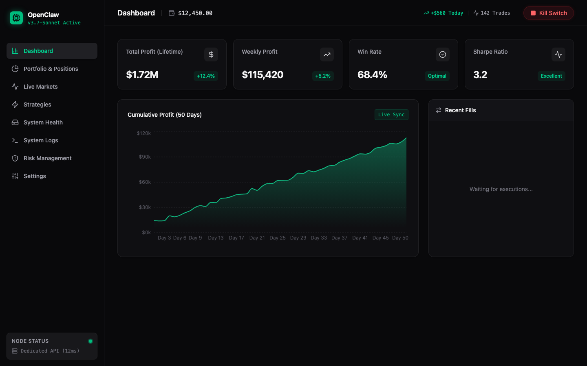
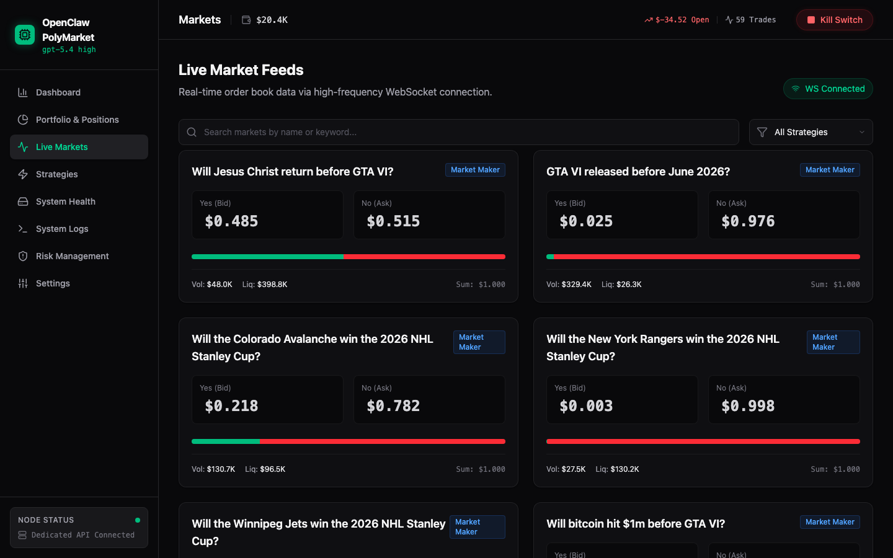
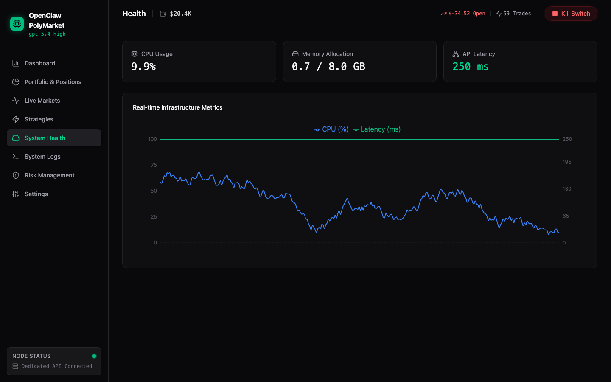
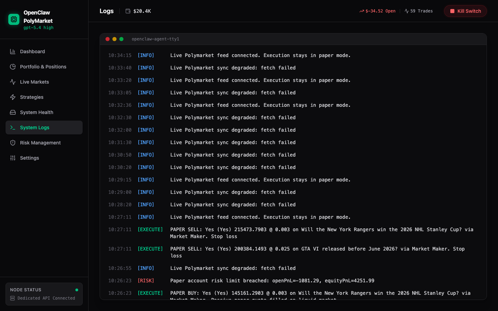

# coke-polymarket

项目已拆分为前后端目录：

- `frontend/`: Vite + React + TypeScript 前端
- `server/`: Express + TypeScript 后端（MySQL 可选）
- `docs/`: 设计与技术方案文档

## 前端运行

1. `cd frontend`
2. `cp .env.example .env.local`
3. `npm install`
4. `npm run dev`
5. 打开 `http://localhost:3000`

## 后端运行

1. `cd server`
2. `cp .env.example .env`
3. `npm install`
4. 可选：`docker compose up -d mysql`
5. `npm run dev`
6. 健康检查：`http://localhost:8080/healthz`

## Frontend E2E tests

1. `cd frontend`
2. Install dependencies:
   `npm install`
3. Install Playwright browser (first run only):
   `npx playwright install chromium`
4. Run headless e2e:
   `npm run test:e2e`
5. Run headed e2e:
   `npm run test:e2e:headed`

## Screenshots

### Dashboard

### Live Markets

### System Health

### System Logs

